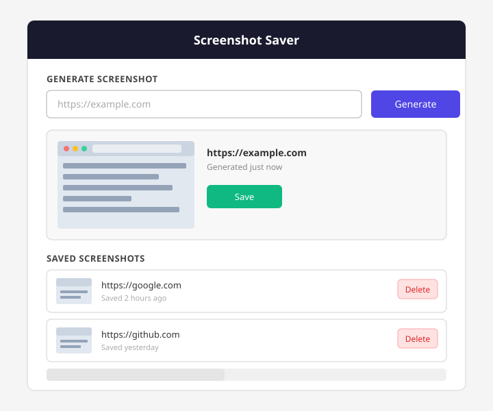

# Assignment

For this week's assignment we will create a web application that generates a screenshot of a website based on a URL. We will combine two APIs: one to generate the screenshot and one to allow the user to save the screenshot.

We use [Rapid API](https://rapidapi.com/apishub/api/website-screenshot6/?utm_source=RapidAPI.com%2Fguides&utm_medium=DevRel&utm_campaign=DevRel) to generate a screenshot and the [crudcrud API](https://crudcrud.com/) to save the screenshot.



## Technical specifications

1. User can enter a URL for a website and it will send back a screenshot of the website using the website-screenshot API
2. User can hit a button to save the screenshot. It will then save the screenshot and the URL as a resource on crudcrud
3. User can get a list of all screenshots that they have saved
4. User can delete a screenshot that they have saved

### Class requirements

1. **Model your UI as classes** with a `render()` method that puts content on the page.
2. **Build an error system** with custom error classes that `extend Error`, each with a way to show a user-friendly message (e.g. `toUserMessage()`).
3. **Handle errors** with `try/catch` and use `instanceof` to treat different error types differently.

Look at your interface and think about what parts can be modeled as classes — if something has data and behavior that go together, or if it can be reused, make it a class. For example, you could create a `Screenshot` class that holds the URL and image data, knows how to render itself as a card on the page, and has a method for deleting itself from crudcrud.

For the error system, think about what kinds of errors can happen in your app — what if the user submits an empty URL? What if the API returns a bad response? What if the network is down? You might end up with classes like `ValidationError`, `ApiError`, or something else entirely — it's up to you.

---

## API Guides

### The Screenshot API (Rapid API)

Sign up at [RapidAPI](https://rapidapi.com) and subscribe to the **website-screenshot6** API (free tier is enough). You will get an API key.

The API takes a website URL and returns **JSON** with a `screenshotUrl` field — a direct link to the generated image you can use in an `` tag.

```js
async function fetchScreenshot(websiteUrl) {
  const response = await fetch(
    `https://website-screenshot6.p.rapidapi.com/screenshot?url=${encodeURIComponent(websiteUrl)}&width=1920&height=1080`,
    {
      method: "GET",
      headers: {
        "x-rapidapi-host": "website-screenshot6.p.rapidapi.com",
        "x-rapidapi-key": "YOUR_API_KEY_HERE",
      },
    },
  );

  if (!response.ok) {
    throw new Error(`Screenshot API error: ${response.status}`);
  }

  // The response is JSON: { screenshotUrl: "https://..." }
  const data = await response.json();
  return data.screenshotUrl;
}
```

> **Keep your API key out of git.** Put it in a `secret.js` file and add that file to `.gitignore`.

---

### The crudcrud API

[crudcrud.com](https://crudcrud.com/) gives you a free, temporary REST API endpoint for storing JSON data. Go to the site and you will get a unique ID — your endpoint will look like:

```text
https://crudcrud.com/api/YOUR_UNIQUE_ID
```

You can create any resource name you like after it, for example `/screenshots`. For this app you need three operations:

| What you want to do       | Method   | URL                   |
| ------------------------- | -------- | --------------------- |
| Get all saved screenshots | `GET`    | `.../screenshots`     |
| Save a new screenshot     | `POST`   | `.../screenshots`     |
| Delete one screenshot     | `DELETE` | `.../screenshots/:id` |

crudcrud automatically assigns an `_id` field to each item you POST. You will need that `_id` to delete items later.

#### Save a screenshot

```js
async function saveScreenshot(websiteUrl, screenshotUrl) {
  const response = await fetch(
    "https://crudcrud.com/api/YOUR_UNIQUE_ID/screenshots",
    {
      method: "POST",
      headers: { "Content-Type": "application/json" },
      body: JSON.stringify({ websiteUrl, screenshotUrl }),
    },
  );

  if (!response.ok) {
    throw new Error(`Failed to save: ${response.status}`);
  }

  // crudcrud returns the saved object with its _id
  const saved = await response.json();
  return saved; // { _id: "abc123", websiteUrl: "https://example.com", screenshotUrl: "https://..." }
}
```

#### Load all screenshots

```js
async function loadScreenshots() {
  const response = await fetch(
    "https://crudcrud.com/api/YOUR_UNIQUE_ID/screenshots",
  );

  if (!response.ok) {
    throw new Error(`Failed to load: ${response.status}`);
  }

  const items = await response.json();
  return items; // Array of { _id, websiteUrl, screenshotUrl }
}
```

#### Delete a screenshot

```js
async function deleteScreenshot(id) {
  const response = await fetch(
    `https://crudcrud.com/api/YOUR_UNIQUE_ID/screenshots/${id}`,
    { method: "DELETE" },
  );

  if (!response.ok) {
    throw new Error(`Failed to delete: ${response.status}`);
  }
}
```

> **Note:** crudcrud endpoints expire after a few days on the free plan. If your app suddenly stops working, go to crudcrud.com and get a new unique ID. Keep your unique ID in `secret.js` alongside your API key.

---

## Using `render()` — when and how

The `render()` method is how a class puts itself on the page. The idea: **the class owns its own DOM element**. Call `render()` to create or update that element, then append the returned element somewhere in the DOM.

Use this base class as a starting point — every UI class in your app should extend it:

```js
class UIComponent {
  constructor() {
    this.element = null;
  }

  render() {
    throw new Error("render() must be implemented by subclass");
  }
}
```

A `Screenshot` class is a natural fit here — it holds the website URL, the screenshot image URL, and its crudcrud `_id`, and it knows how to display itself. Think about:

- What data does it need? (constructor)
- What does its card look like? (render)
- What can it do? (methods like delete)

```js
class Screenshot extends UIComponent {
  constructor(websiteUrl, screenshotUrl, id) {
    super();
    this.websiteUrl = websiteUrl;
    this.screenshotUrl = screenshotUrl; // direct image URL from the API
    this.id = id; // _id from crudcrud — needed to delete later
  }

  render() {
    // create this.element if it doesn't exist yet, then build the HTML
    // use this.screenshotUrl directly as the  src
    // return this.element so the caller can append it to the page
  }

  async delete() {
    // call the crudcrud delete function, then remove this.element from the DOM
  }
}

// Usage
const card = new Screenshot(
  "https://example.com",
  "https://storage.linebot.site/...",
  "abc123",
);
document.getElementById("screenshots-list").appendChild(card.render());
```

**When to call `render()`:**

- Right after creating a new instance — to show it on screen
- After data on the instance changes and the DOM should reflect it

---

## Error handling — when and how

Not all errors are the same. A user typing nothing in the input is different from the API being down. Custom error classes let you handle each case differently.

Here is a starting point — adapt it to fit your actual app:

```js
class ValidationError extends Error {
  constructor(message) {
    super(message);
    this.name = "ValidationError";
  }
  toUserMessage() {
    return `Invalid input: ${this.message}`;
  }
}

class ApiError extends Error {
  constructor(message, statusCode) {
    super(message);
    this.name = "ApiError";
    this.statusCode = statusCode;
  }
  toUserMessage() {
    return `Something went wrong with the request (${this.statusCode}). Try again.`;
  }
}
```

Use `throw` to signal that something went wrong, and `try/catch` with `instanceof` to handle each type:

```js
async function handleGenerateScreenshot(websiteUrl) {
  try {
    if (!websiteUrl || websiteUrl.trim() === "") {
      throw new ValidationError("URL cannot be empty");
    }

    const screenshotUrl = await fetchScreenshot(websiteUrl);
    // ... display the screenshot using screenshotUrl as  src
  } catch (error) {
    if (error instanceof ValidationError) {
      // User made a mistake — show a friendly message next to the input
      showError(error.toUserMessage());
    } else if (error instanceof ApiError) {
      // API problem — tell the user to try again
      showError(error.toUserMessage());
    } else {
      // Unexpected error — log it for debugging
      console.error(error);
      showError("An unexpected error occurred.");
    }
  }
}
```

**Where to use error handling in this app:**

- When the user submits the form: validate that the URL field is not empty
- When calling the screenshot API: catch network failures or non-2xx responses
- When calling crudcrud (save, load, delete): catch failures and tell the user

---

## Optional Tasks/Assignments

> **Note:** Users do not need to be stored in a database or API — just keep them in memory (e.g. an array of instances in your JavaScript). No need to persist them anywhere.

1. Create a user object with an email and password. Keep it in a variable or array.
2. Show a login form first.
3. If the email and password match the user you created, show the application. Otherwise show an error message.
4. Create another user. When saving a screenshot, also save the user email (or another unique identifier).
5. Make sure you only show screenshots that the logged-in user has uploaded.

---

> Keep in mind the API key for the website-screenshot API and the unique ID for crudcrud should be in a `secret.js` file which is not committed to git.
