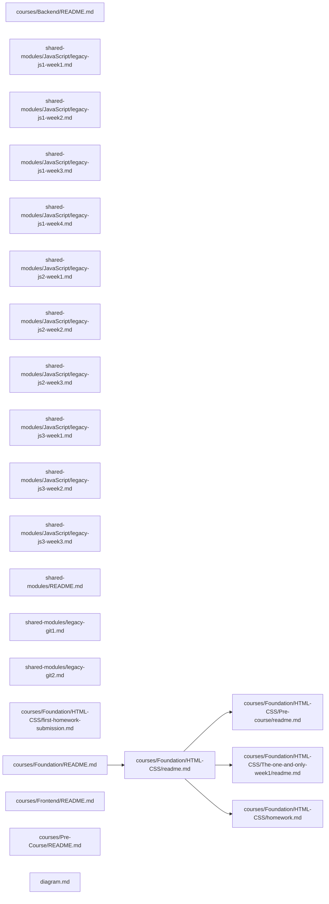

```mermaid
graph LR;
  id0["courses/Backend/README.md"]
  id10["shared-modules/JavaScript/legacy-js1-week1.md"]
  id11["shared-modules/JavaScript/legacy-js1-week2.md"]
  id12["shared-modules/JavaScript/legacy-js1-week3.md"]
  id13["shared-modules/JavaScript/legacy-js1-week4.md"]
  id14["shared-modules/JavaScript/legacy-js2-week1.md"]
  id15["shared-modules/JavaScript/legacy-js2-week2.md"]
  id16["shared-modules/JavaScript/legacy-js2-week3.md"]
  id17["shared-modules/JavaScript/legacy-js3-week1.md"]
  id18["shared-modules/JavaScript/legacy-js3-week2.md"]
  id19["shared-modules/JavaScript/legacy-js3-week3.md"]
  id1["courses/Foundation/HTML-CSS/Pre-course/readme.md"]
  id20["shared-modules/README.md"]
  id21["shared-modules/legacy-git1.md"]
  id22["shared-modules/legacy-git2.md"]
  id2["courses/Foundation/HTML-CSS/The-one-and-only-week1/readme.md"]
  id3["courses/Foundation/HTML-CSS/first-homework-submission.md"]
  id4["courses/Foundation/HTML-CSS/homework.md"]
  id5["courses/Foundation/HTML-CSS/readme.md"]
  id6["courses/Foundation/README.md"]
  id7["courses/Frontend/README.md"]
  id8["courses/Pre-Course/README.md"]
  id9["diagram.md"]
  id5-->id1
  id5-->id2
  id5-->id4
  id6-->id5
```
