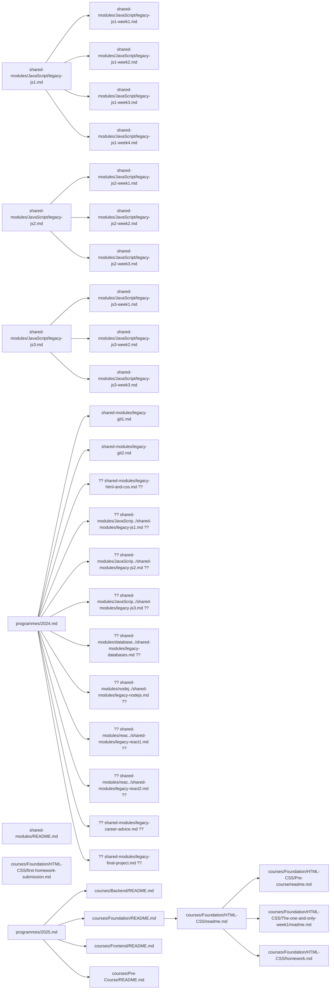

# Diagram

```mermaid
graph LR;
  id0["courses/Backend/README.md"]
  id10["programmes/2025.md"]
  id11["shared-modules/JavaScript/legacy-js1-week1.md"]
  id12["shared-modules/JavaScript/legacy-js1-week2.md"]
  id13["shared-modules/JavaScript/legacy-js1-week3.md"]
  id14["shared-modules/JavaScript/legacy-js1-week4.md"]
  id15["shared-modules/JavaScript/legacy-js1.md"]
  id16["shared-modules/JavaScript/legacy-js2-week1.md"]
  id17["shared-modules/JavaScript/legacy-js2-week2.md"]
  id18["shared-modules/JavaScript/legacy-js2-week3.md"]
  id19["shared-modules/JavaScript/legacy-js2.md"]
  id1["courses/Foundation/HTML-CSS/Pre-course/readme.md"]
  id20["shared-modules/JavaScript/legacy-js3-week1.md"]
  id21["shared-modules/JavaScript/legacy-js3-week2.md"]
  id22["shared-modules/JavaScript/legacy-js3-week3.md"]
  id23["shared-modules/JavaScript/legacy-js3.md"]
  id24["shared-modules/README.md"]
  id25["shared-modules/legacy-git1.md"]
  id26["shared-modules/legacy-git2.md"]
  id28["?? shared-modules/legacy-html-and-css.md ??"]
  id29["?? shared-modules/JavaScrip../shared-modules/legacy-js1.md ??"]
  id2["courses/Foundation/HTML-CSS/The-one-and-only-week1/readme.md"]
  id30["?? shared-modules/JavaScrip../shared-modules/legacy-js2.md ??"]
  id31["?? shared-modules/JavaScrip../shared-modules/legacy-js3.md ??"]
  id32["?? shared-modules/database../shared-modules/legacy-databases.md ??"]
  id33["?? shared-modules/nodej../shared-modules/legacy-nodejs.md ??"]
  id34["?? shared-modules/reac../shared-modules/legacy-react1.md ??"]
  id35["?? shared-modules/reac../shared-modules/legacy-react2.md ??"]
  id36["?? shared-modules/legacy-career-advice.md ??"]
  id37["?? shared-modules/legacy-final-project.md ??"]
  id3["courses/Foundation/HTML-CSS/first-homework-submission.md"]
  id4["courses/Foundation/HTML-CSS/homework.md"]
  id5["courses/Foundation/HTML-CSS/readme.md"]
  id6["courses/Foundation/README.md"]
  id7["courses/Frontend/README.md"]
  id8["courses/Pre-Course/README.md"]
  id9["programmes/2024.md"]
  id10-->id0
  id10-->id6
  id10-->id7
  id10-->id8
  id15-->id11
  id15-->id12
  id15-->id13
  id15-->id14
  id19-->id16
  id19-->id17
  id19-->id18
  id23-->id20
  id23-->id21
  id23-->id22
  id5-->id1
  id5-->id2
  id5-->id4
  id6-->id5
  id9-->id25
  id9-->id26
  id9-->id28
  id9-->id29
  id9-->id30
  id9-->id31
  id9-->id32
  id9-->id33
  id9-->id34
  id9-->id35
  id9-->id36
  id9-->id37
```
